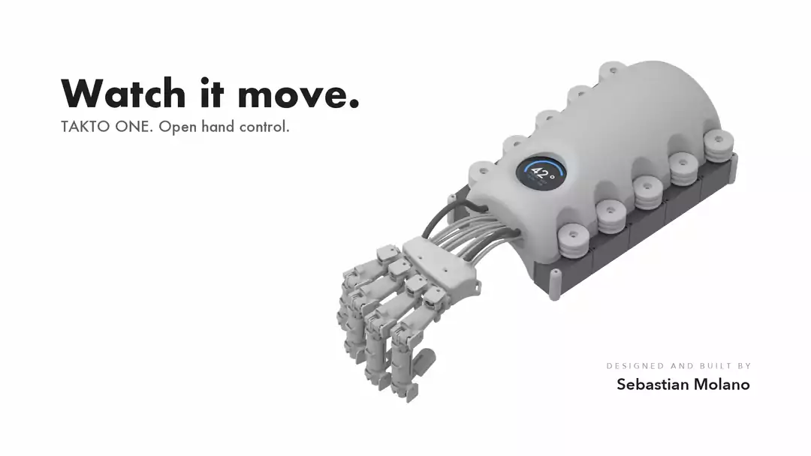
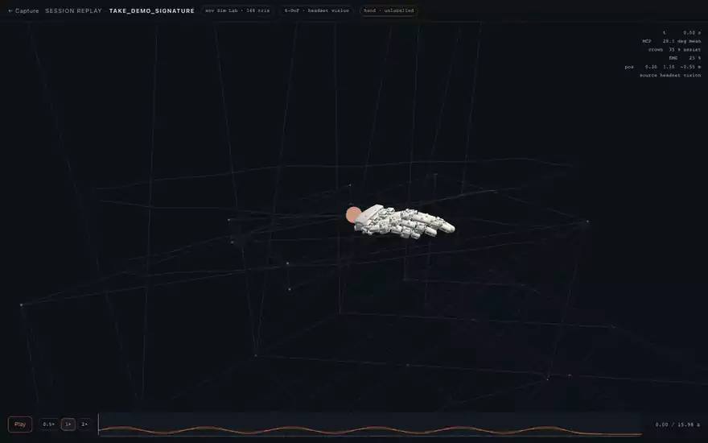
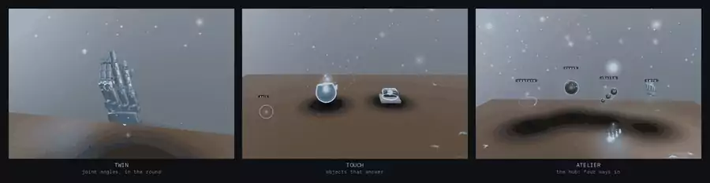
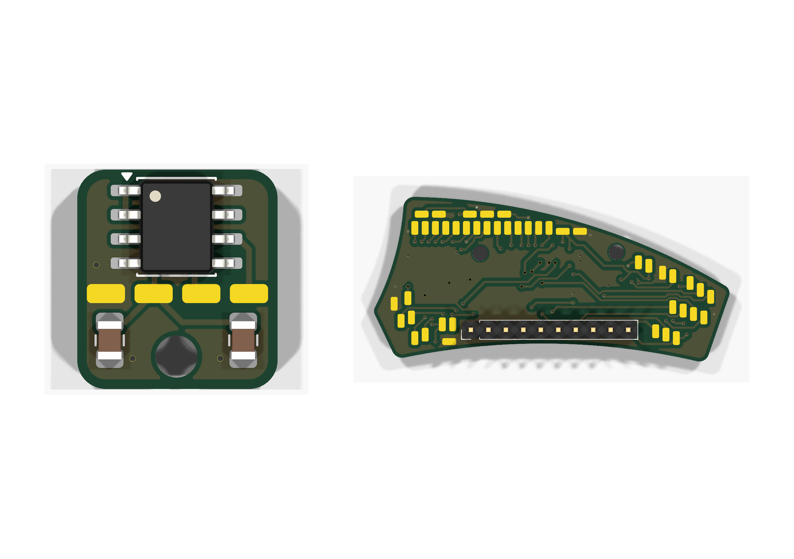
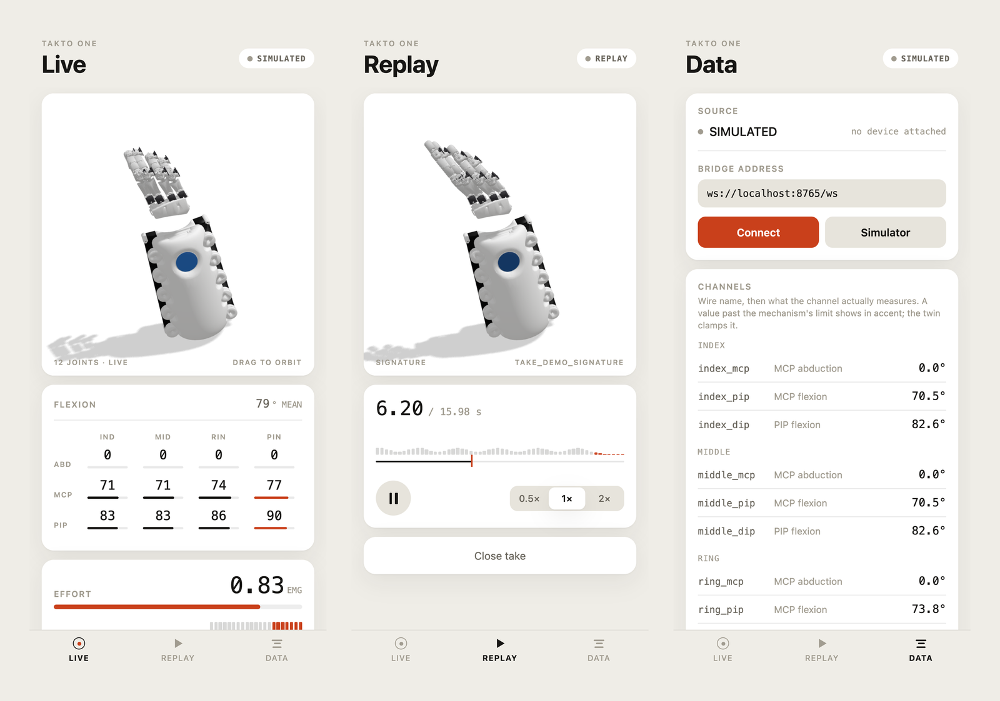
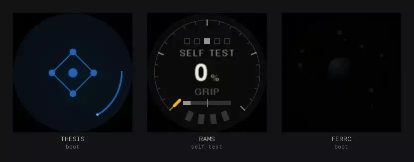

## Sebastian Molano

Robotics engineer. I design, build and program wearable robots end to end: the mechanism,
the boards, the firmware, the control loop, and the software on the other side of the wire.

M.Sc. Biomedical Engineering, Hochschule Anhalt · Germany ·
[LinkedIn](https://www.linkedin.com/in/sm29) · [sebastian.molano.29@gmail.com](mailto:sebastian.molano.29@gmail.com)

<picture>
  <source media="(prefers-color-scheme: dark)" srcset="assets/capabilities-dark.svg">
  
</picture>

---

### TAKTO ONE

An open-source hand exoskeleton that reads all twelve finger joints at the joint itself and
drives them back through tendons, with the control loop on the device. I designed, built and
programmed all of it: the mechanism, two custom PCBs, the Teensy firmware, and a live 3D twin
for browser, headset and phone.

<table>
<tr>
<td width="50%"></td>
<td width="50%"></td>
</tr>
<tr>
<td><b>The machine.</b> Four tendon-driven fingers, ten spool bays, a round display on the forearm.</td>
<td><b>Session replay.</b> Twelve joint angles and the 6-DoF wrist path, played back in space.</td>
</tr>
</table>

<b>LUMEN, the AR layer.</b> The twin and its data in the room instead of on a monitor. WebXR, same stream as the console.

<table>
<tr>
<td width="50%"></td>
<td width="50%"></td>
</tr>
<tr>
<td><b>Two boards, from scratch.</b> Encoder board, one per joint, and the palm carrier that fans them out. KiCad.</td>
<td><b>Phone companion.</b> Live twin, replay, channels. One Expo codebase for iOS, Android and the browser.</td>
</tr>
</table>

<b>The device's own screen.</b> Three faces, every state animated, drawn by a dirty-tile renderer inside the firmware's frame budget.

  

**Where it stands.** Four fingers built and instrumented, all twelve encoders reading live,
motor-driven finger motion demonstrated on the bench. Force rendering and assistance are not
yet characterised. The full open release, CAD, KiCad, firmware and software, is in preparation.

---

### Published

Pieces pulled out of the work above and released on their own.

| | | |
| --- | --- | --- |
| **[consent-scoped-agent-negotiation](https://github.com/molanocortes/consent-scoped-agent-negotiation)** | Two people's AI agents settle a bounded decision without either seeing the other's private data. Signed consent, an injection-proof wire format, an offline adversarial suite. | Python&nbsp;·&nbsp;MIT |
| **[dynamixel-on-device](https://github.com/molanocortes/dynamixel-on-device)** | The Dynamixel Protocol 2.0 loop on the microcontroller instead of a host PC. Fast Sync Read, allocation-free, testable on a laptop with no hardware. | C++&nbsp;·&nbsp;AGPL‑3.0 |
| **[bno085-multi](https://github.com/molanocortes/bno085-multi)** | Several BNO085 IMUs on one microcontroller at full rate. Every byte of protocol state lives inside the object. | C&nbsp;·&nbsp;MIT |
| **[latex-safe-build](https://github.com/molanocortes/latex-safe-build)** | LaTeX builds in an isolated scratch copy, so a build can never corrupt the tree it builds from. | Shell&nbsp;·&nbsp;MIT |
| **[multi-volume-controller](https://github.com/molanocortes/multi-volume-controller)** | A per-app volume mixer for macOS on Core Audio process taps. No driver, no admin install. | Swift&nbsp;·&nbsp;AGPL‑3.0 |
| **[penumbra-screen-dimmer](https://github.com/molanocortes/penumbra-screen-dimmer)** | A Mac screen darker than the hardware minimum, click-through, across every Space. | Python&nbsp;·&nbsp;MIT |

<!-- When takto-one goes public, add it at the head of this table:
| **[takto-one](https://github.com/molanocortes/takto-one)** | Everything needed to build the device above: CAD, KiCad boards, Teensy firmware, bridge, console, AR layer, app, BOM. | Apache‑2.0&nbsp;·&nbsp;CERN‑OHL‑S&nbsp;·&nbsp;CC‑BY‑4.0 |
and change the last sentence of "Where it stands" to point at it.

     The film in assets/takto/film.webp is an animated WebP of docs/media/TAKTO-ONE.mp4.
     GitHub can also play the real MP4 with sound-capable controls, but only from a
     user-attachments URL minted in a PUBLIC repo: open any issue in this repo, drag
     TAKTO-ONE.mp4 into the comment box, copy the https://github.com/user-attachments/...
     URL it produces, and put it alone on its own line in place of the  above.
     Portfolio: add a sebastianmolano.com link to the header line once it is deployed. -->
