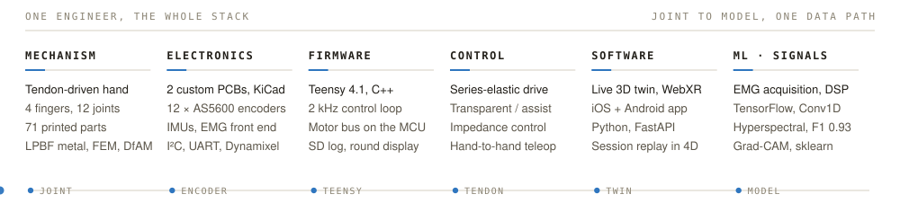
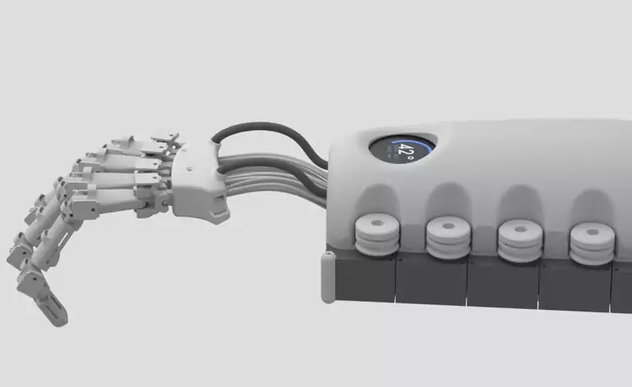

## Sebastian Molano

Robotics systems engineer. Mechanical engineer by training, top 1 % of Colombia's national
graduate exam; M.Sc. Biomedical Engineering at Hochschule Anhalt, embedded focus. I take
physical robots from mechanism to boards to firmware to the software that drives them.

I want to work on embodied AI, and I already build with AI at the bench. TAKTO ONE below is
what one engineer ships that way.

Thesis submitted. Available now for robotics R&D roles in Europe, and for collaborations on
the device. Köthen, Germany · Spanish, English, German, Portuguese ·
[LinkedIn](https://www.linkedin.com/in/sm29) · [sebastian.molano.29@gmail.com](mailto:sebastian.molano.29@gmail.com)

<picture>
  <source media="(prefers-color-scheme: dark) and (max-width: 600px)" srcset="assets/capabilities-dark-mobile.svg">
  <source media="(prefers-color-scheme: dark)" srcset="assets/capabilities-dark.svg">
  <source media="(max-width: 600px)" srcset="assets/capabilities-light-mobile.svg">
  
</picture>

**The whole thing.** Sketch, CAD, boards, firmware, live twin in the browser. One pair of
hands, no handoffs.

**Measured, not claimed.** Every rate has its own number. Bench results are called bench
results.

**Built to be built.** Everything ships as source: parts you can print, boards you can order,
code that runs with no hardware attached.

---

### TAKTO ONE

**Open-source hand exoskeleton. My master's thesis.** It measures twelve finger joints at the
joint itself, drives eight tendons from the forearm, and runs the control loop on the device.
Designed, built and programmed by one person.

**Why it is built this way.** A camera loses fingers the moment they cross or curl, a glove of
flex sensors drifts, and a control loop that goes through a laptop is not a control loop. So:
a magnetic encoder on every joint, a Teensy that owns the motor bus, and one twin that runs
from the same stream on a monitor, in a headset or on a phone.

The repository is everything needed to build one: CAD, two KiCad boards, Teensy firmware,
bridge and console, AR layer, phone app, BOM, illustrated build guide. The whole stack runs
in simulation before you print a part.

**[Explore the repository →](https://github.com/molanocortes/takto-one)**

Bench status: four fingers built and instrumented, twelve encoders live, motor-driven finger motion demonstrated. Force rendering and assistance not yet characterised.

---

### If you have five minutes

- **Read code:** [dynamixel-on-device](https://github.com/molanocortes/dynamixel-on-device). A servo-bus protocol loop with no heap and bounded waits, proven by tests that run on a laptop with no servo attached.
- **Read reasoning:** [consent-scoped-agent-negotiation](https://github.com/molanocortes/consent-scoped-agent-negotiation). Threat model, wire spec, and an adversarial suite that tries to break both.
- **See the device move:** [the TAKTO console](https://github.com/molanocortes/takto-one/tree/main/software/console) runs in simulation from one command, no hardware, twelve joints and the 3D twin live.

---

### Also built

**Research associate, metal additive manufacturing, Hochschule Anhalt.** A year on the laser
powder-bed machine with AlSi10Mg: FEM predicting residual stress and distortion before a
build, heat treatments to relieve them, microscopy on the result, and work on raising the
alloy's stiffness through crystal orientation. Presented it at Hannover Messe 2026 in four
languages. What it buys a robot: complex geometry without the mass, from a print you can trust.

**Team lead and first author, EMG-driven underactuated gripper.** Three of us, one working
gripper: five-bar fingers with springs for underactuation, two EMG channels off a BIOPAC, a
finite-state controller switching on signal thresholds.

**Hyperspectral tissue classification, F1 0.934 held out.** 92 bands. Logistic regression,
SVM and random forest against dense and Conv1D networks in TensorFlow, with Grad-CAM to see
what the networks looked at. The random forest won, so that is what I reported.

**Design engineer, Cargobot, autonomous logistics.** Mechanical components for autonomous
logistics robots, CAD through CAM. Before that, a remote-controlled machine that carries
250 kg marble slabs.

---

### Released on their own

Pulled out of the work above because they stand on their own.

**[dynamixel-on-device](https://github.com/molanocortes/dynamixel-on-device)** C++ · AGPL-3.0 
Dynamixel Protocol 2.0 on the microcontroller, no host PC. Fast Sync Read, no heap,
unit-testable without hardware.

**[bno085-multi](https://github.com/molanocortes/bno085-multi)** C · MIT 
Several BNO085 IMUs on one MCU at full rate. The stock driver is single-instance by
construction; this one is reentrant.

**[consent-scoped-agent-negotiation](https://github.com/molanocortes/consent-scoped-agent-negotiation)** Python · MIT 
Protocol design for AI agents: two of them settle a bounded decision without seeing each
other's private data. Signed consent, a wire format with nowhere for an injection to live,
an offline adversarial suite.

**[latex-safe-build](https://github.com/molanocortes/latex-safe-build)** Shell · MIT 
LaTeX builds in an isolated copy. A build can never corrupt its own source tree.

Also for the Mac: [multi-volume-controller](https://github.com/molanocortes/multi-volume-controller),
a driver-free per-app volume mixer on Core Audio process taps, and
[penumbra-screen-dimmer](https://github.com/molanocortes/penumbra-screen-dimmer), which dims
the screen below the hardware minimum.

<!-- Portfolio: add a sebastianmolano.com link to the header line once it is deployed. -->
