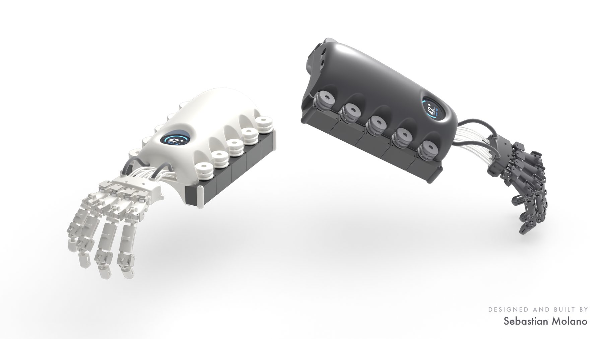

## Sebastian Molano

Robotics engineer. I design, build and program wearable robots end to end: the mechanism,
the boards, the firmware, the control loop, and the software on the other side of the wire.
I came to it through design, so I care what the thing feels like in the hand, not only
whether the loop closes.

M.Sc. Biomedical Engineering, Hochschule Anhalt · Germany ·
[LinkedIn](https://www.linkedin.com/in/sm29) · [sebastian.molano.29@gmail.com](mailto:sebastian.molano.29@gmail.com)

<picture>
  <source media="(prefers-color-scheme: dark)" srcset="assets/capabilities-dark.svg">
  
</picture>

**The whole thing.** I take a device from sketch to CAD to boards to firmware to a live twin
in the browser, and I do not hand off in between.

**Measured, not claimed.** Every rate gets its own number, status is stated plainly, and
nothing is called done that only ran on the bench.

**Built to be built.** What I make ships as source: parts you can print, boards you can order,
code you can run with no hardware attached.

---

### TAKTO ONE

<table>
<tr>
<td width="54%" valign="top"></td>
<td width="46%" valign="top">
<b>An open-source hand exoskeleton, and my master's thesis.</b> Twelve finger joints read at the joint itself, eight tendons driven from the forearm, the control loop on the device. One person designed, built and programmed all of it.
  
The repository is everything needed to build one: CAD, two KiCad boards, Teensy firmware, the bridge and operator console, the AR layer, the phone companion, the bill of materials and an illustrated build guide. The whole stack runs in simulation, so you can explore it before printing a part.
  
<b><a href="https://github.com/molanocortes/takto-one">Explore the repository →</a></b>
  
Status: four fingers built and instrumented, twelve encoders reading live, motor-driven finger motion demonstrated on the bench. Force rendering and assistance are not yet characterised.
</td>
</tr>
</table>

---

### Released on their own

Pieces pulled out of the work above, because they are useful without the rest of it.

| | | |
| --- | --- | --- |
| **[dynamixel-on-device](https://github.com/molanocortes/dynamixel-on-device)** | The Dynamixel Protocol 2.0 loop on the microcontroller instead of a host PC. Fast Sync Read, allocation-free, testable on a laptop with no hardware. | C++&nbsp;·&nbsp;AGPL‑3.0 |
| **[bno085-multi](https://github.com/molanocortes/bno085-multi)** | Several BNO085 IMUs on one microcontroller at full rate. Every byte of protocol state lives inside the object. | C&nbsp;·&nbsp;MIT |
| **[consent-scoped-agent-negotiation](https://github.com/molanocortes/consent-scoped-agent-negotiation)** | Two people's AI agents settle a bounded decision without either seeing the other's private data. Signed consent, an injection-proof wire format, an offline adversarial suite. | Python&nbsp;·&nbsp;MIT |
| **[latex-safe-build](https://github.com/molanocortes/latex-safe-build)** | LaTeX builds in an isolated scratch copy, so a build can never corrupt the tree it builds from. | Shell&nbsp;·&nbsp;MIT |
| **[multi-volume-controller](https://github.com/molanocortes/multi-volume-controller)** | A per-app volume mixer for macOS on Core Audio process taps. No driver, no admin install. | Swift&nbsp;·&nbsp;AGPL‑3.0 |
| **[penumbra-screen-dimmer](https://github.com/molanocortes/penumbra-screen-dimmer)** | A Mac screen darker than the hardware minimum, click-through, across every Space. | Python&nbsp;·&nbsp;MIT |

<!-- Portfolio: add a sebastianmolano.com link to the header line once it is deployed. -->
