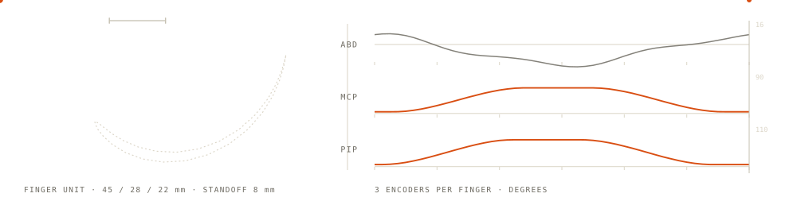
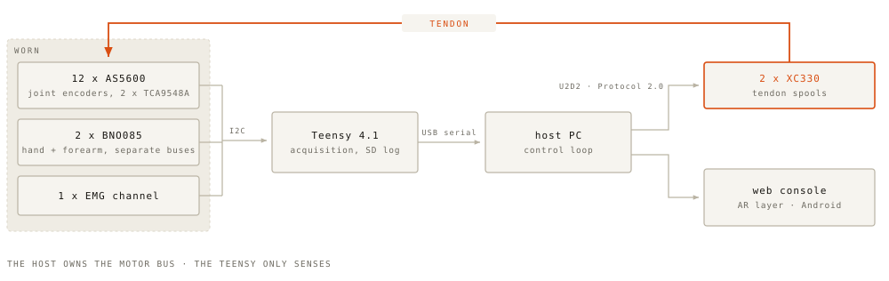

<picture>
  <source media="(prefers-color-scheme: dark)" srcset="assets/hero-dark.svg">
  
</picture>

## Sebastian Molano

Robotics engineer. I build wearable robots end to end: the mechanism and the CAD, the
boards, the firmware, the real-time control, and the interfaces on the other side of the
wire. I came to it through design, so I care what the thing feels like in the hand, not
only whether the loop closes.

M.Sc. Biomedical Engineering, Hochschule Anhalt. Germany.

The drawing above is a real linkage, not decoration. Its link lengths, dorsal standoff,
telescopic slide law and joint coupling are the ones the device's digital twins render from,
so the mechanism moves the way the built one does. Source:
<a href="assets/render_hero.py">assets/render_hero.py</a>.

---

### TAKTO ONE

An open, low-cost hand exoskeleton for rehabilitation research, and the subject of my
master's thesis.

All four long fingers are built and instrumented, three magnetic joint encoders each,
twelve in total. Every finger runs the same mechanism, the same tendon routing and the
same antagonist belt drive, scaled to its own size, and the forearm housing provisions
ten tendon-spool bays.

<picture>
  <source media="(prefers-color-scheme: dark)" srcset="assets/system-map-dark.svg">
  
</picture>

The split is deliberate. The Teensy only acquires and logs; the host owns the motor bus
through a U2D2 and closes the loop. Two boxes in that diagram are libraries I pulled out
and published: the IMU node runs [`bno085-multi`](https://github.com/molanocortes/bno085-multi),
and [`dynamixel-on-device`](https://github.com/molanocortes/dynamixel-on-device) exists to
move that bus off the host entirely.

### Three surfaces, one contract

The device is only half of it. The same host serves one WebSocket contract to three
clients that stay in sync with each other, so a session recorded on one is visible on
all of them.

**Web console.** The operator surface: live telemetry, motor tools, guided sessions,
capture, and a CAD digital twin driven from the encoders. Also carries the sign-language
capture and translation surfaces.

**LUMEN, the AR layer.** A WebXR passthrough experience for the headset. The robotic
hand renders in the room next to the real one, driven by the same stream, with an
environment scan so the twin sits on your actual desk.

**Android companion.** The same console on a phone, pairing by QR, speaking the exact
same host contract so anything that serves the web console serves the app unchanged.

Underneath them: a **series-elastic tendon control stack**, a cascaded tension and
impedance controller that closes the loop on the joint encoders and uses the springs as
force sensors.

An executable spec spins the host up in simulation, connects all three surfaces and
proves shared recording, host-side rep counting, motor clamping and hostile-input
tolerance across them.

> These four live in the project repository and are **not public yet**. They go out with
> the open release of the device, not before.

---

### Published

Pieces I pulled out of the above and released on their own, because they are useful
without the rest of it.

**[dynamixel-on-device](https://github.com/molanocortes/dynamixel-on-device)** · C++ · AGPL-3.0
Runs the Dynamixel Protocol 2.0 loop on the microcontroller instead of a host PC. Fast Sync
Read, allocation-free, bounded waits, and a wire protocol you can unit-test on a laptop with
no hardware attached.

**[bno085-multi](https://github.com/molanocortes/bno085-multi)** · C · MIT
Two or more BNO085 IMUs on one microcontroller at full rate. The stock library keeps its
protocol state in file-scope globals and is single-instance by construction; this one keeps
every byte inside the object.

**[latex-safe-build](https://github.com/molanocortes/latex-safe-build)** · Shell · MIT
Compiles LaTeX in an isolated scratch copy, so a build can never corrupt the document it is
building. Written while several agent sessions edited one thesis tree at once.

**[multi-volume-controller](https://github.com/molanocortes/multi-volume-controller)** · Swift · AGPL-3.0
A per-app volume mixer for macOS on Core Audio process taps. No driver, no admin install, and
it never becomes your default output device, so it cannot leave you without sound.

**[penumbra-screen-dimmer](https://github.com/molanocortes/penumbra-screen-dimmer)** · Python · MIT
Takes a Mac screen darker than the hardware minimum, click-through, across every Space and
full-screen app.

---

### Elsewhere

[LinkedIn](https://www.linkedin.com/in/sm29) · [sebastian.molano.29@gmail.com](mailto:sebastian.molano.29@gmail.com)

<!-- Portfolio: add this line once sebastianmolano.com is deployed.
     [sebastianmolano.com](https://sebastianmolano.com) -->
