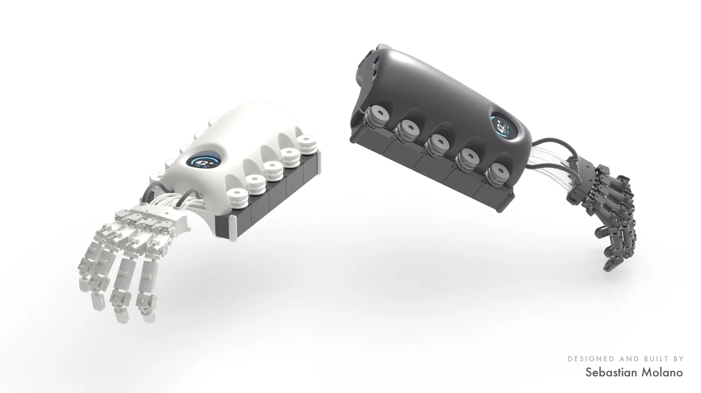
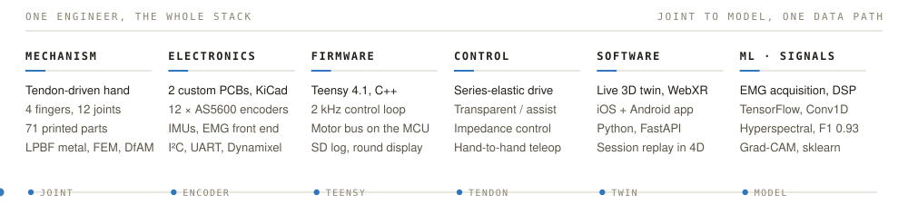
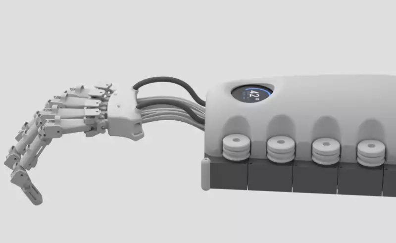
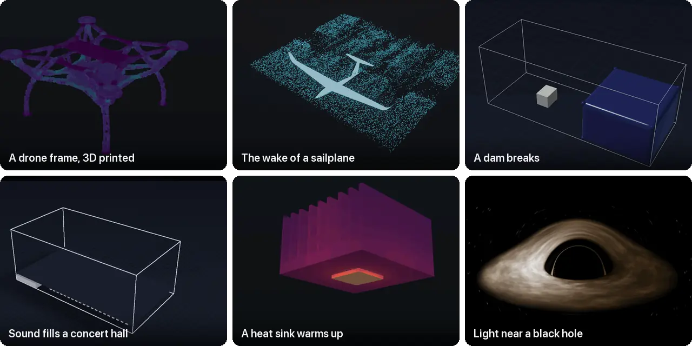

## Sebastian Molano

Robotics systems engineer. Mechanical engineer by training, top 1 % of Colombia's national
graduate exam; M.Sc. Biomedical Engineering at Hochschule Anhalt, embedded focus. I take
physical robots from mechanism to boards to firmware to the software that drives them.

I want to work on embodied AI, and I already build with AI at the bench. The two projects
below are what one engineer ships that way: a hand exoskeleton and a physics lab.

Thesis submitted. Available now for robotics R&D roles in Europe, and for collaborations on
the device. Köthen, Germany · Spanish, English, German, Portuguese ·
[LinkedIn](https://www.linkedin.com/in/sm29) · [sebastian.molano.29@gmail.com](mailto:sebastian.molano.29@gmail.com)

<picture>
  <source media="(prefers-color-scheme: dark) and (max-width: 600px)" srcset="assets/capabilities-dark-mobile.svg">
  <source media="(prefers-color-scheme: dark)" srcset="assets/capabilities-dark.svg">
  <source media="(max-width: 600px)" srcset="assets/capabilities-light-mobile.svg">
  
</picture>

**The whole thing.** Sketch, CAD, boards, firmware, live twin in the browser. One pair of
hands, no handoffs.

**Measured, not claimed.** Every rate has its own number. Bench results are called bench
results.

**Built to be built.** Everything ships as source: parts you can print, boards you can order,
code that runs with no hardware attached.

---

### TAKTO ONE

**Open-source hand exoskeleton. My master's thesis.** It measures twelve finger joints at the
joint itself, drives eight tendons from the forearm, and runs the control loop on the device.
Designed, built and programmed by one person.

**Why it is built this way.** A camera loses fingers the moment they cross or curl, a glove of
flex sensors drifts, and a control loop that goes through a laptop is not a control loop. So:
a magnetic encoder on every joint, a Teensy that owns the motor bus, and one twin that runs
from the same stream on a monitor, in a headset or on a phone.

The repository is everything needed to build one: CAD, two KiCad boards, Teensy firmware,
bridge and console, AR layer, phone app, BOM, illustrated build guide. The whole stack runs
in simulation before you print a part.

**[Explore the repository →](https://github.com/molanocortes/takto-one)**

Bench status: four fingers built and instrumented, twelve encoders live, motor-driven finger motion demonstrated. Force rendering and assistance not yet characterised.

---

### OpenPhysicsAI

**An open-source physics lab for people and AI agents, and a competition to make it better.**
More than twenty verified solvers, from turbulence, shocks and fire to heat, solids, sound,
radar, magnetic fields and orbits: C with Metal on the GPU, a native 3D app, a command line
and MCP. Designed and directed by one engineer, built with AI agents. Public since September 2026.

**Why it is built this way.** Code is getting cheap to write; physics you can trust is not.
So every solver is checked against a closed form or an independent solution before it ships,
every number in a scenario carries its unit, and an agent finds the right solver in a few
thousand tokens instead of writing one from scratch.

**Thirteen flags.** Measurements of the real world that no simulator has predicted yet, from
the wake of a car to a human heartbeat. Anyone can download the lab, try to improve it with
their own AI and submit it: a machine reruns and scores every pull request against the sealed
measurements, and what wins is merged for everyone.

**[Explore the repository →](https://github.com/molanocortes/OpenPhysicsAI)**

Status: thirteen flags posed, four trials scored, none captured yet. The solvers are verified against theory; the flags are how they get validated against measurement.

---

### Also built

**Research associate, metal additive manufacturing, Hochschule Anhalt.** A year on the laser
powder-bed machine with AlSi10Mg: FEM predicting residual stress and distortion before a
build, heat treatments to relieve them, microscopy on the result, and work on raising the
alloy's stiffness through crystal orientation. Presented it at Hannover Messe 2026 in four
languages. What it buys a robot: complex geometry without the mass, from a print you can trust.

**Team lead and first author, EMG-driven underactuated gripper.** Three of us, one working
gripper: five-bar fingers with springs for underactuation, two EMG channels off a BIOPAC, a
finite-state controller switching on signal thresholds.

**Hyperspectral tissue classification, F1 0.934 held out.** 92 bands. Logistic regression,
SVM and random forest against dense and Conv1D networks in TensorFlow, with Grad-CAM to see
what the networks looked at. The random forest won, so that is what I reported.

**Design engineer, Cargobot, autonomous logistics.** Mechanical components for autonomous
logistics robots, CAD through CAM. Before that, a remote-controlled machine that carries
250 kg marble slabs.

---

<!-- Portfolio: add a sebastianmolano.com link to the header line once it is deployed. -->
